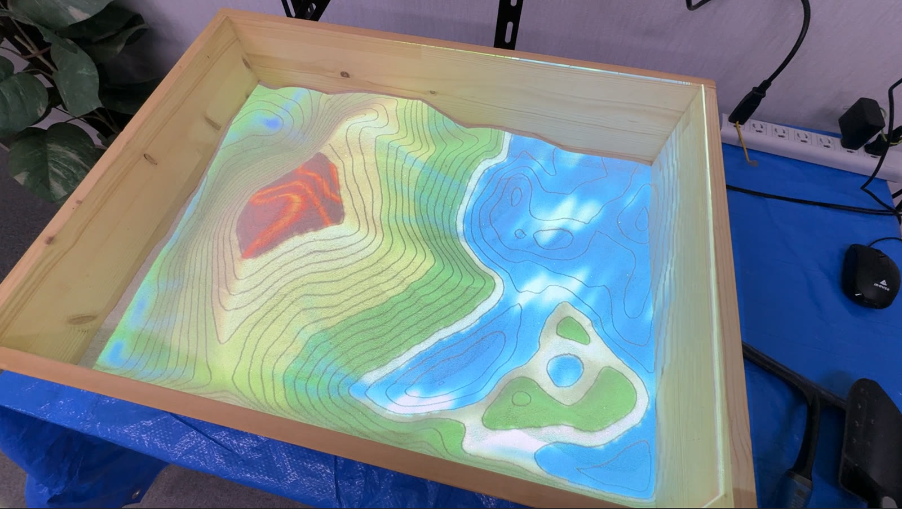
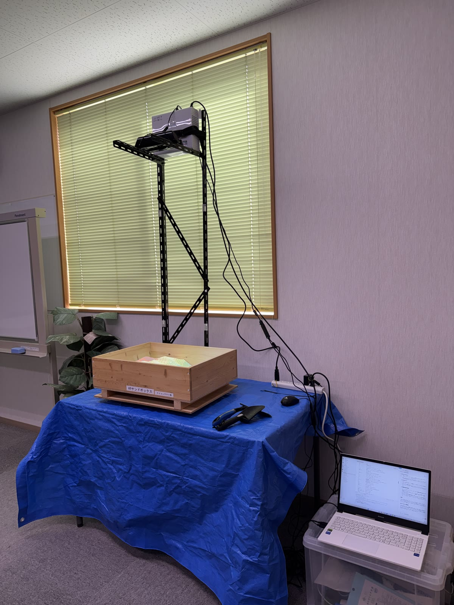
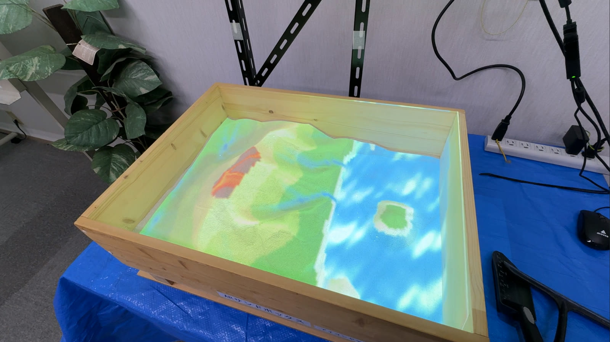
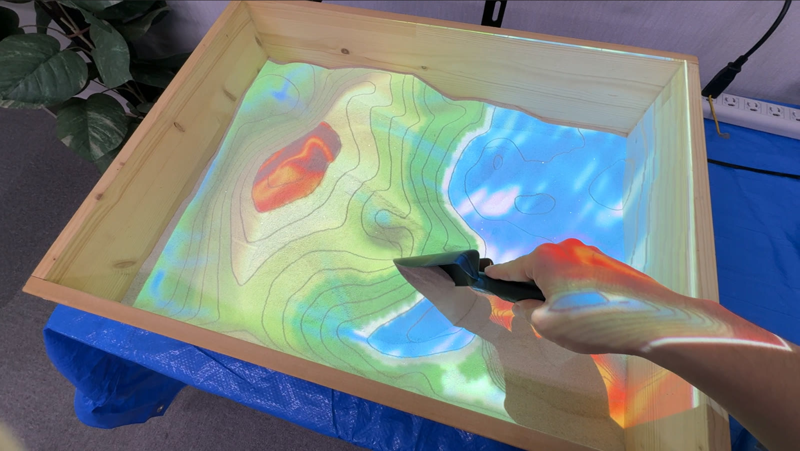
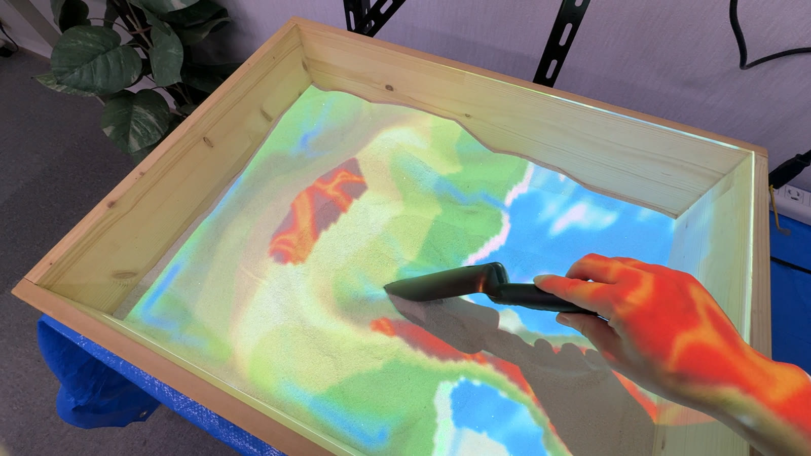
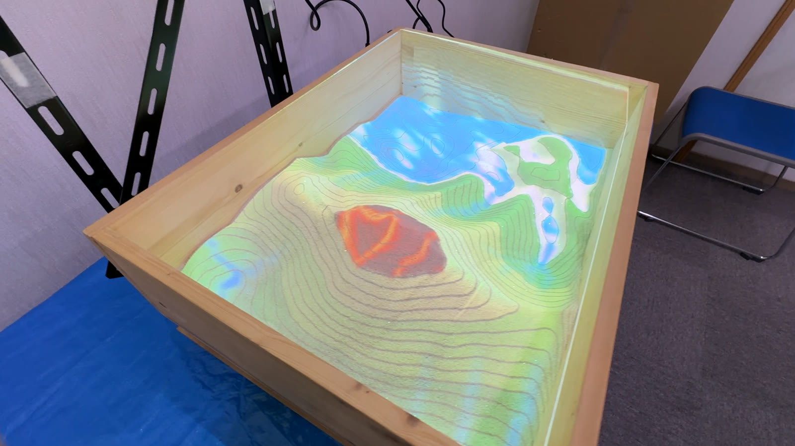

# TopoSandbox

Kinect v1 で砂場の起伏を計測し、**基準面からの標高に応じた段彩・等高線・水面**を描いた映像を、同じ砂場へプロジェクタで投影する TopoSandboxです。

参加者が手で砂を掘ったり盛ったりすると、その場で標高・傾斜に応じた色分け・等高線・水面がリアルタイムに投影され、地形と地図の関係を体感できます。



## 用途

小学校などでの**出前授業**や**展示会イベント**で実際に活用してきた展示プログラムです。この「現場で来場者の前で動かす」という用途が、以下のような設計の前提になっています。

- `F11` による枠なし全画面表示（プロジェクタ出力用）
- 画面に日本語メッセージを出すキーボード主体の操作系（マウス操作は投影エリアの指定のみ）
- 掘ると水がたまり盛ると山になる DEM 表示など、地理の教材として意味を持つ表現

---

## 構成

```
TopoSandbox/
├── src/topo_sandbox/
│   ├── __main__.py        コマンドライン入口
│   ├── app.py             Tkinter の画面とキー操作
│   ├── settings_store.py  現場で合わせた値の保存と読み込み（settings.json）
│   ├── renderer.py        1 フレーム分の描画パイプライン
│   ├── recorder.py        DEM の高さ[mm]の書き出し（--record。外部アプリのテスト入力用）
│   ├── streamer.py        DEM の高さ[mm]のライブ配信（--stream。topo-sandbox-live へ送る）
│   ├── config.py          解像度・調整値などの定数
│   ├── palette.py         傾斜角 → 色 の変換テーブル（361 色）
│   ├── sensor/            深度フレームの供給元
│   │   ├── base.py        DepthSource インタフェース
│   │   ├── kinect.py      Kinect v1（pythonnet 経由で SDK を直接利用）
│   │   └── replay.py      保存画像の再生（Kinect 不要）
│   └── processing/        画像処理
│       ├── depth.py       欠測の穴埋めと表示用階調への変換
│       ├── plane.py       基準面の推定とセンサの傾き補正
│       ├── pointcloud.py  深度画像 → 点群
│       ├── coloring.py    法線 → 傾斜角 → 彩色（GPU）
│       ├── rivers.py      流向と流量（D8 法。CPU のみ）
│       └── overlays.py    DEM・地形（水面と標高帯）・陰影・エッジ・等高線（CPU のみ）
├── assets/                README 用の写真
├── data/test_frames/      再生モード用の深度画像
├── data/records/          --record で書き出した高さ（追跡しない）
├── scripts/
│   ├── run.bat            起動ランチャ
│   └── view_record.py     録画した .npy を画像として見る
└── tests/                 Kinect も GPU も不要な範囲のテスト
```

### データフロー

```
  Kinect v1                    または  data/test_frames の画像
     │  640x480 @30fps                      │
     ▼                                      ▼
  sensor/kinect.py                    sensor/replay.py
     │  深度[mm] uint16。測定できなかった画素は 0（欠測）
     ▼
  renderer.py
     │  1. 欠測を埋め、320×240 へ縮小 + 平滑化   ※すべて mm のまま
     │  2. 深度 → 点群 (x, y, z)         z = (基準面 - 深度[mm]) × z_scale
     │  3. Open3D で法線推定              CPU
     │  4. 傾斜角 → 配色テーブル          GPU (CuPy)
     │  5. 800×600 へ拡大 + 左右反転
     │  6. 射影変換（任意）
     ▼
  app.py → Tkinter Canvas → プロジェクタ投影
```

**点群はミリメートルのまま作ります。** 8bit へ落とすのは画面に出す深度・DEM・等高線の階調を作るときだけです。点群を作る前に丸めてしまうと、丸め幅ごとに深度が衝突して砂場に実在しない崖ができ、帯状の偽の色境界が出ます。

`z_scale` は「1mm あたり何単位の高さにするか」を表します。

---

## 動作要件

以下は 2026-09-18 時点で動作を確認した構成です。

- Windows 11
- **Kinect for Windows SDK v1.8** — インストーラが環境変数 `KINECTSDK10_DIR` を設定します
- Kinect v1 センサ本体 + **電源アダプタ**（USB だけでは動作しません）
- **メモリ整合性（HVCI）が無効であること** — 有効だと Kinect ドライバが読み込まれません。「トラブルシューティング」参照
- Python 3.9（conda / miniforge）
- **CUDA 対応 GPU** と CUDA Toolkit 12.x — 彩色処理に CuPy を使います

動作確認環境: RTX 5070 Laptop (Blackwell / sm_120) + CUDA 12.8 + cupy 13.6.0

---

## セットアップ

砂場の上にプロジェクタと Kinect を吊るし、同じ面へ投影します。下は出前授業での設営例です。



### 1. Kinect for Windows SDK v1.8 をインストール

Kinect を接続し、デバイスマネージャーで `Kinect for Windows Camera` が正常表示されることを確認してください。**コード 39 で失敗する場合は次の手順が必要です。**

### 2. メモリ整合性（HVCI）を無効化する ★必須

`kinectcamera.sys` は 2012 年製で HVCI 非対応のため、有効なままでは読み込まれません。

設定 → プライバシーとセキュリティ → Windows セキュリティ → デバイス セキュリティ → コア分離 → **メモリ整合性をオフ** → 再起動

> ⚠️ これはカーネル保護機能の無効化でセキュリティリスクがあります。

### 3. Python 環境の構築

[miniforge](https://github.com/conda-forge/miniforge) をインストールしてから:

```bat
mamba create -n ar_sandbox python=3.9
mamba activate ar_sandbox
pip install -r requirements.txt
```

> miniforge を全ユーザー向け（`C:\ProgramData\miniforge3`）に入れた場合、一般ユーザーでは
> パッケージキャッシュに書き込めず env を作成できません。`%USERPROFILE%\.condarc` に
> 以下を設定するか、「Just Me」で入れ直してください。
>
> ```yaml
> envs_dirs: [C:\Users\<user>\.conda\envs]
> pkgs_dirs: [C:\Users\<user>\.conda\pkgs]
> ```

### 4. ランチャのパス確認

[scripts/run.bat](scripts/run.bat) に conda と CUDA の絶対パスが書かれています。環境が異なる場合は修正してください。

---

## 使い方

**[scripts/run.bat](scripts/run.bat) を実行します。** conda 環境の有効化と `CUDA_PATH` の設定を行ってからアプリを起動します。

```bat
run.bat              通常起動
run.bat --replay     Kinect 無しで保存画像を再生（動作確認用）
run.bat --near       Near Mode（Kinect for Windows センサのみ）
run.bat --bench      フレーム取得性能の実測（GUI 無し）
run.bat --record     DEM の高さを書き出す（開発用。「DEM の高さを書き出す」参照）
run.bat --stream     砂場の高さを別画面のライブ表示へ送る（「ライブ表示アプリへ送る」参照）
```

800×600 のウィンドウが開きます。`F11` で全画面（枠なし最大化）に切り替え、プロジェクタ側のディスプレイへ移動して使用します。

### 投影エリアの指定

砂場の四隅が画面上のどこに写っているかを、**左上から反時計回りに 4 点**キャンバス上でクリックします。`j` キーで射影変換モードに切り替えると、その 4 点が画面全体へ引き伸ばされます。

この 4 点は投影範囲だけでなく、**基準面（`k`）をあてはめる範囲**も兼ねます。そのため
**エリアの指定を先に済ませてから `k` を押してください。**

### 設定の保存

`Ctrl` + `S` で、そのときの設定を `settings.json`（リポジトリ直下）へ書き出します。
次の起動で自動的に読み込まれるので、**同じ設置なら合わせ直しが要りません。**

保存されるのは、エリアの四隅・投影枠・Z スケール・カラー感度・水位・等高線と川の
表示・川の出やすさ・表示モード・マッピングモード・**基準面**です。JSON なので中身を
見て手で直すこともできます。壊れていたり版が違ったりするときは、既定値で起動して
画面にその旨を出します（設定が読めないくらいで実演を止めないため）。

**センサやプロジェクタを動かしたら、基準面（`k`）と投影枠（`p`）は取り直してください。**
読み込んだ基準面は前回の設置のものです。

### 初期値へ戻す

| やりたいこと | 操作 |
| --- | --- |
| Z スケール・カラー感度・水位・川の出やすさ・表示モードを戻す | `Ctrl` + `R` |
| 設営（エリアの四隅・投影枠・基準面）ごと戻す | `Ctrl` + `Shift` + `R` |
| 水位だけ / 投影枠だけ / 基準面だけ戻す | `Shift` + `N` / `Shift` + `P` / `Shift` + `K` |
| 保存した内容も消す | `Ctrl` + `Shift` + `R` のあと `Ctrl` + `S`、または `settings.json` を削除 |

**どちらの操作も `settings.json` には触りません。**戻した状態を次回も使うなら、続けて
`Ctrl` + `S` で保存してください。保存を上書きせずに元へ戻したいときは、そのまま再起動すれば
保存した設定が読み直されます。

---

## キーバインド

| キー | 動作 |
| --- | --- |
| `F11` | 全画面表示のトグル |
| `v` | 表示モード切替（彩色 → 深度 → DEM → エッジ → 彩色 …） |
| `t` | 等高線表示のトグル（5mm ごと。起伏が広いときは自動で間隔を広げる。センサの揺れでは動かない） |
| `n` / `m` | **水位**の上げ下げ ±5mm（DEM 表示。上げると陸が沈み、下げると海底が現れる） |
| `Shift` + `N` | 水位を初期値へ戻す |
| `r` | **川**の表示トグル（DEM 表示。降った雨が集まる筋を描く） |
| `Shift` + `R` | 川の**出やすさ**を切り替え（とても多い → 多い → ふつう → 少ない） |
| `j` | マッピングモード切替（NORMAL ⇄ PERSPECTIVE） |
| `z` / `x` | Z スケール（高さの強調）増減 ±0.01 |
| `a` / `s` | カラー感度（傾斜の色分け感度）増減 ±0.1（0〜4 の範囲） |
| `k` | **基準面を取得**（砂を平らにならしてから押す。約 1 秒。先にエリアを 4 点指定しておくこと） |
| `Ctrl` + `S` | **いまの設定を保存**（次の起動で自動的に読み込まれる） |
| `Ctrl` + `R` | **調整値を初期値へ戻す**（エリア・投影枠・基準面は残る） |
| `Ctrl` + `Shift` + `R` | **設営も含めてすべて初期値へ戻す**（エリアと基準面も消える） |
| `p` | **投影枠の合わせ込み**モードの出入り |
| `Tab` | （投影枠モード中）動かす角を選ぶ |
| `Shift` + `P` | 投影枠を画面全体へ戻す |
| `Shift` + `K` | 基準面を破棄する（傾き補正を無効に戻す） |
| `c` | エリア座標のクリア（誤操作防止のため無効化されています） |
| `←` `→` `↑` `↓` | エリア 4 点をまとめて平行移動 |
| `Shift` + 方向キー | その方向へエリアを拡張 |
| `Shift` + `Ctrl` + 方向キー | その方向へエリアを縮小 |
| 左クリック | エリア座標を 1 点追加（最大 4 点） |

操作結果は画面左上に約 40 フレームの間メッセージ表示されます。

---

## 表示モード

| モード | 内容 |
| --- | --- |
| `COLORING` | 点群の法線から水平面に対する傾斜角を求め、361 色の虹色テーブルで着色。平坦＝赤系、急斜面＝青〜紫系。 |
| `DEPTH` | 深度を白黒反転して表示。中央値を中心とした 256mm 幅を階調に割り当て、外側はクリップする。 |
| `DEM` | **主となる表示**。**基準面が取れているとき**は、基準面からの絶対高さで塗り分ける。水位（初期値 -40mm、`n` / `m` で上下）より低い画素は水になり、掘ると水がたまる。陸は砂浜→低地→丘陵→山地→高地→雪の段彩で、さらに陰影起伏を重ねて山らしく見せる。水面は波の傾きが光源を映してきらめき、水際には白波が立つ。**しきい値（`VOLCANO_HEIGHT_MM`、現在 +130mm）を超えるまで高く盛ると火山**になり、黒く固まった表面の割れ目から赤い溶岩が覗く。割れ目は向きの違う 2 組のうねりを重ねて作り、時間とともにゆっくり形を変える。`r` で**川**を重ねると、降った雨がどこへ集まるかが筋として出る。フレームごとの正規化をしないので、砂を動かしても水際や雪線が動かない。<br>**基準面が無いとき**は従来どおり、フレーム内の最小・最大標高で正規化し、色相 0°（最高地点）〜240°（最低地点）へマッピングする。 |
| `EDGE` | 傾斜が変化する色相の帯だけを抽出して表示。 |

### 投影の様子

いずれも `DEM` 表示です。

| | |
| --- | --- |
|  |  |
| 標高帯の段彩と水面。掘ったところに水がたまり、水際に白波が立つ。 | `t` で等高線を重ねたところ。コテで砂を動かすと、段彩も等高線もその場で追従する。 |
|  |  |
| 基準面 +60mm を超えて高く盛った山は火山になり、固まった表面の割れ目から溶岩が覗く。 | 等高線は高さ[mm]から引いているので、高く盛った頂上にも線が出る。 |

---

## 開発

```bat
pytest                 テスト（Kinect も GPU も不要）
ruff check .           lint
ruff format .          整形
```

テストは Kinect と GPU を必要としない範囲（深度変換・欠測の穴埋め・表示用階調・配色テーブル・点群化・DEM／地形／陰影／等高線）を対象にしています。**彩色本体と GUI は実機での確認が必要**です。`--replay` を使うと Kinect 無しで画面まで通せます。

### DEM の高さを書き出す（`--record`）

砂場の起伏を点群にして別のディスプレイへ出すアプリを作るとき、その**テスト入力**を
本機から取り出すための機能です。**`--record` を付けなければ何も起きません。**
通常の起動手順もキーバインドも変わりません。

```bat
run.bat --record                         既定（data/records/ へ、上限 1800 枚）
run.bat --record --record-crop           砂場の四隅の内側だけを切り出す
run.bat --record --record-dir D:\dem      書き出し先を変える
run.bat --record --record-frames 300     上限を変える（0 で無制限）
run.bat --replay --record                Kinect 無しで試す
```

書き出すのは**投影している絵ではなく高さ[mm]**です。欠測の穴埋め・平滑化・
センサの揺れの抑えと、基準面による傾き補正まで済んでいるので、受け取る側は
そのまま点群にできます（[pointcloud.py](src/topo_sandbox/processing/pointcloud.py)
の `heights_from_depth` の出力そのもの）。

**DEM 表示のあいだだけ**書き出します。起動後に `v` で DEM へ切り替えてください。
また、高さの原点を砂面に合わせるため **`k` で基準面を取っておいてください。**
基準面が無いまま録るとフレームごとの中央値が原点になり、砂を動かすたびに
高さの原点が動きます（`meta.json` の `origin` で見分けられます）。

`--record-dir` の下に `dem_YYYYmmdd_HHMMSS` ができ、その中に次が入ります。

| ファイル | 中身 |
| --- | --- |
| `frame_000001.npy` … | 高さ[mm] (240, 320) float32。正が高い。`numpy.load` でそのまま読める |
| `index.csv` | `frame,elapsed_s`。書けたフレームの番号と経過秒 |
| `meta.json` | 大きさ・単位・符号・基準面・水位・取りこぼし枚数・切り取りの有無 |

読み込む側の例:

```python
import json
from pathlib import Path

import numpy as np

directory = Path(r"data\records\dem_20261002_093138")
meta = json.loads((directory / "meta.json").read_text(encoding="utf-8"))

for path in sorted(directory.glob("frame_*.npy")):
    height_mm = np.load(path)  # (240, 320) float32、基準面からの高さ[mm]
    ...  # x = 列、y = 行、z = height_mm で点群にする
```

- 1 枚 300KB（320×240 float32）です。30fps で約 9MB/秒、既定の上限 1800 枚で
  約 550MB・約 60 秒ぶんになります。上限に達すると書き出しを止め、画面とコンソールに
  知らせを出します（アプリは動き続けます）。
- 書き込みは別スレッドで行い、**間に合わないフレームは捨てます。** 投影が砂場から
  遅れるくらいなら録画のほうを諦める、という優先順位です。捨てた枚数は `meta.json` の
  `dropped` に出ます。連番は詰めて振るので、ファイルの抜けではなく `index.csv` の
  経過秒の間隔として現れます。
- 列はセンサから見たままの向きです。投影像は左右反転しているので、投影と向きを
  揃えたいときは列を反転してください（`meta.json` の `axes`）。

#### 砂場の内側だけを録る（`--record-crop`）

既定ではセンサの視野**全体**を書き出します。砂場のまわりの床は一面の窪地として、
センサの前を横切った人は高い壁として入ります。

**`--record-crop` を付けると、砂場の四隅（エリア指定）の内側だけを切り出して
長方形へ直します。** 出てくる 320×240 がまるごと砂場になるので、受け取る側で
切る必要がありません。

- **エリアが未指定のあいだは書き出しません。** 画面とコンソールにその旨を出します。
  視野全体のフレームが混ざると、あとからどれが砂場だけなのか見分けられなくなるためです。
  エリアは `settings.json` に保存されるので、同じ設置なら起動時に読み込まれます。
- 切り取ったものは**すでに投影と同じ向き**です（画面で最初にクリックした角が左上）。
  エリアの四隅は左右反転したあとの表示像で指定するため、切り取りの時点で反転が入ります。
- x と y は砂場の端から端までを等分したもので、**ミリメートルではありません。**
  四隅の間隔は設営のたびに変わるため、ここで長さを決めようがないからです。
  高さ（z）だけがミリメートルです。
- どちらで録ったかは `meta.json` の `cropped` と `axes` に出ます。切り取りに使った
  四隅も `crop_area_positions` に残ります。

#### 録画を見る

書き出した `.npy` は [scripts/view_record.py](scripts/view_record.py) で絵にして確認できます。
Kinect も GPU も要りません。

```bat
python scripts\view_record.py                       いちばん新しい録画を再生
python scripts\view_record.py data\records\dem_...   録画を指定して再生
python scripts\view_record.py --mode gray           白黒（高さの階調）で見る
python scripts\view_record.py --save out            画面を出さずに PNG へ書き出す
```

| キー | 動作 |
| --- | --- |
| `space` | 止める／動かす |
| `a` / `d`（`←` / `→`） | 1 フレーム戻る／進む |
| `g` | DEM の色分けと白黒を切り替え |
| `t` | 等高線の重ね描きを切り替え |
| `r` | 先頭へ戻る |
| `s` | いま映っている絵を PNG で保存 |
| `q` / `Esc` | 終わる |

色分けは本体と同じ `overlays.terrain_color` を呼んでいるので、投影で見ていたものと
そのまま見比べられます。`index.csv` の経過秒どおりに再生するため、録画時に
取りこぼしがあればそこで間が空きます。既定は投影と同じ向き（左右反転後）で、
`--sensor` を付けると `.npy` に入っているままの並びになります。
`--record-crop` で録ったものはすでに投影と同じ向きなので反転しません（`--sensor` も効きません）。

### ライブ表示アプリへ送る（`--stream`）

砂場の起伏を、別のディスプレイに 2.5 次元の地形としてリアルタイムに映すための機能です。
受け取る側は別リポジトリの **topo-sandbox-live**（ブラウザで表示する Three.js の地形ビューア）です。
**`--stream` を付けなければ何も起きません。** 通常の起動手順もキーバインドも変わりません。

```bat
run.bat --stream                                       同じ PC の topo-sandbox-live へ送る
run.bat --stream ws://192.168.0.10:8000/ws/ingest      別の PC へ送る
run.bat --replay --stream                              Kinect 無しで試す
```

受け取る側は topo-sandbox-live を次の設定で起動しておきます（どちらを先に起動しても構いません）。

```bat
cd topo-sandbox-live\backend
.venv\Scripts\python -m app --config configs\topo_sandbox.toml
```

- 送るのは録画と同じく**投影している絵ではなく高さ[mm]**です（穴埋め・平滑化・揺れの抑え・
  基準面による傾き補正が済んだもの）。1 枚 300KB、30fps で約 9MB/秒です。
  別の PC へ送るときは有線 LAN を推奨します。
- **表示モードを問わず送ります。** 実演中に `v` で切り替えても別画面の地形は止まりません。
- **砂場の四隅（エリア）が決まっていれば内側だけ**を、決まっていなければ視野全体を送ります。
  どちらも投影像と同じ向き（左右反転後）に揃えてあるので、四隅を指定しても地形は裏返りません。
- 高さの原点を砂面に合わせるため **`k` で基準面を取っておいてください。**
  基準面が無いと原点がフレームごとの中央値になり、受け取る側に「no reference plane」と出ます。
- 送信は別スレッドで行い、**間に合わないフレームは捨てて最新の 1 枚だけを送ります**
  （溜めるとライブ表示が砂場から遅れるため）。投影の処理は送信を待ちません。
- 相手が起動していない・途中で切れた、というときは 2 秒おきにつなぎ直し続けます。
  つながったとき・切れたときだけ、画面左上とコンソールに 1 度知らせが出ます。
- WebSocket クライアントとして websocket-client（[requirements.txt](requirements.txt)）を使います。
  入っていなければ配信だけを諦めて起動します。

送る形は 1 フレーム 1 メッセージのバイナリです（ヘッダ長 uint32 + JSON ヘッダ + float32 の高さ）。
詳しくは [streamer.py](src/topo_sandbox/streamer.py) の冒頭を見てください。

### 彩色アルゴリズム（COLORING モード）

1. 深度画像 320×240 の各画素を格子座標 `(x, y)` とし、`z = (基準面 - 深度[mm]) * z_scale` で 3 次元点群（76,800 点）を生成
2. Open3D の `estimate_normals`（KDTree hybrid, radius=30, max_nn=10）で法線を推定
3. `orient_normals_towards_camera_location` で法線の向きを点群中心の上方 500 に揃える
4. 法線 `n` の傾斜角 `θ = arccos(|n_z| / |n|)` を CuPy で GPU 計算（76,800 点を一括処理）
5. `θ[度] × カラー感度` を添字として [palette.py](src/topo_sandbox/palette.py) の 361 色テーブルを引く

---

## イベント当日の手順

1. Kinect（電源アダプタ込み）とプロジェクタを接続する。
2. `scripts/run.bat` を実行する。
3. ウィンドウをプロジェクタ側のディスプレイへ移動し、`F11` で全画面にする。
4. 砂場の四隅を**左上から反時計回りに** 4 点クリックし、`j` で射影変換モードにする。
5. **砂を平らにならして `k` を押す**（基準面の取得。約 1 秒）。画面に距離・傾き・残差が出る。
   **手順 4 のエリアが基準面をあてはめる範囲になる**ので、順番を入れ替えないこと。
6. **`p` を押し、投影された枠を砂場の縁に合わせる**（`Tab` で角を選び、方向キーで移動）。終わったら `p` で確定。
7. `z` / `x` で高さの強調、`a` / `s` で傾斜の色分け感度を、砂の盛り方に合わせて調整する。
8. **`Ctrl` + `S` で設定を保存する。** 次の起動は手順 4〜7 を省いて、この状態から始められる（センサやプロジェクタを動かしたときは取り直すこと）。

調整をやり直したくなったら `Ctrl` + `R`（調整値だけ）、設営からやり直すなら `Ctrl` + `Shift` + `R` です。

デモ中は `v` で表示モード、`t` で等高線を切り替えて見せられます。

DEM 表示では手順 5 の基準面をもとに水位が決まるため、掘ると水がたまり、盛ると山の段彩と陰影がつきます。さらに次の 2 つが見せ場になります。

- **`n` で水位を上げる**と、低いところから順に沈み、山が島になり、最後は火口だけが残ります。`m` で下げれば海底が現れます。`Shift` + `N` で元に戻ります。
- **高く盛った山は火山になります。** しきい値は基準面 +130mm（[config.py](src/topo_sandbox/config.py) の `VOLCANO_HEIGHT_MM`）です。誰も届かないようなら下げ、すぐ噴火してしまうなら上げてください。
- **`r` で川を出す**と、降った雨がどこへ集まるかが筋で見えます。尾根を挟んで川の向きが変わるところが分水嶺です。砂を掘って流れを変えると、川の形もその場で変わります。川が少なすぎる／多すぎるときは **`Shift` + `R`** で出やすさを切り替えてください（初期値は「多い」）。

### 基準面について（手順 5）

設営のたびにセンサの取り付け角度は変わります。センサが砂場に対して垂直でないと、
**平らにならした砂が一様な斜面として着色され**、本来の起伏が狭い色域に押し込まれます。

`k` を押すと約 1 秒ぶんのフレームから平面をあてはめ、以後の高さをその平面からの
距離で測ります。取り付け角度のずれが打ち消されるため、**センサを厳密に垂直へ
据える必要がなくなります。**

あてはめに使うのは**手順 4 で指定したエリアの内側だけ**です。センサの視野には
砂場の枠や床、まわりに立っている人まで写り込んでおり、視野全体で 1 枚の平面を
あてはめると、砂面ではなく「砂場と周囲をまとめて均した面」になります。砂場の外は
砂面より遠いことが多いので、基準面が砂面から離れて傾き、**平らにならした砂の高さが
0 になりません**（DEM の水位がずれる、平らな砂に色がつく、という形で現れます）。

エリアを指定せずに `k` を押すと従来どおり視野全体であてはめ、結果の行末に
「※エリア未指定のため視野全体で求めました」と出ます。

画面に出る数値の読み方:

```
基準面 1042mm  傾き 3.2°  残差 1.8mm  有効 87%
```

| 項目 | 意味 | 目安 |
| --- | --- | --- |
| 基準面 | 画像中心での砂面までの距離 | 設置高さの確認に使う |
| 傾き | センサの取り付け角度のずれ | 補正されるので大きくても可 |
| **残差** | 平面からのばらつき | **これが小さいほど良い。大きければ砂をならし直す** |
| 有効 | エリア内であてはめに使えた画素の割合 | 低いときは砂場に物陰が多い |

残差が大きいと「※砂がならせていない可能性があります」と警告が出ます。
**基準面が正しく取れたかを数値で判断できる**ので、勘に頼らずに済みます。

手をかざした状態で押しても、外れ値として除外されるので大きくは狂いません。
ただし外れ値の除去は「平面からのばらつき」を見ているだけなので、床のように
広い面積を占めるものは落ちません。範囲を絞るのはエリアの役目です。

やり直したいときはもう一度 `k`、補正を止めたいときは `Shift` + `K` です。

### 投影枠について（手順 6）

射影変換には 2 つの四隅が要ります。

| | 何を表すか | 決め方 |
| --- | --- | --- |
| **センサ側**（手順 4） | センサから見て砂場がどこに写っているか | 画面をクリック |
| **投影側**（手順 6） | 投影像のどこが砂場か | 投影された枠を砂場の縁に重ねる |

**投影側を指定できるので、プロジェクタは大まかに置くだけで済みます。** 台形になっても、
はみ出しても、余っても、枠を砂場の角に合わせれば投影像が砂場に収まります。

```
┌─────────────────────────────┐
│  ╔═══════════════════════╗  │   緑の枠 = 投影範囲
│  ║                       ║  │   黄の十字 = 選択中の角
│  ║   Tab    角を選ぶ      ║  │
│  ║   ←→↑↓  1 画素動かす   ║  │
│  ║   Shift+←→↑↓  10 画素  ║  │
│  ╚═══════════════════════╝  │
└─────────────────────────────┘
```

枠は投影像そのものに出るので、**砂場の縁と一致しているかをその場で確認できます。**

やり直したいときは `Shift` + `P` で画面全体に戻せます。

---

## トラブルシューティング

実際に遭遇した問題と原因です。いずれも再発しやすいので記録しておきます。

### Kinect が認識されない / デバイスマネージャーでコード 39

**原因: メモリ整合性（HVCI）が有効。** イベントログに以下が出ます。

```
CodeIntegrity 3111: kinectcamera.sys is not compatible with hypervisor enforcement.
Kernel-PnP 219:     ドライバー \Driver\KinectCamera を読み込めませんでした。
```

対処はセットアップ手順 2 を参照。確認コマンド:

```powershell
Get-CimInstance -ClassName Win32_DeviceGuard -Namespace root\Microsoft\Windows\DeviceGuard |
    Select-Object SecurityServicesRunning     # {2} が出たら HVCI 稼働中 = 要無効化
```

なお **USB ハブだけが見えて配下のカメラが出ない場合は電源アダプタ未接続**を疑ってください。こちらはドライバではなく給電の問題です。

### cupy が `nvrtc64_120_0.dll` を見つけられない

**原因: `CUDA_PATH` が古い CUDA を指している。** 複数バージョンを入れていると起こります。

- Python 3.8 以降は **DLL 探索に PATH を使いません**。PATH に CUDA の bin を足しても解決しません
- `pip install nvidia-cuda-nvrtc-cu12` でも解決しません（今度は `nvrtc-builtins64_*.dll` で失敗します）

`CUDA_PATH` を CUDA 12.x に向けてください。[scripts/run.bat](scripts/run.bat) が起動時に設定しています。グローバルに変更すると CUDA 11.x を前提にした他プロジェクトに影響するため、ランチャ内で閉じています。

### GPU を新しくしたら cupy が動かない

**cupy は GPU 世代に対応した CUDA が必要です。** RTX 5070 (Blackwell / sm_120) は CUDA 11.x では動かないため、`cupy-cuda117` は使えません。`cupy-cuda12x` を使ってください。

### run.bat が「'xxx' は認識されていません」で失敗する

**原因: バッチファイルが UTF-8 で保存されている。** cmd は CP932 で解釈するため、日本語コメントが壊れて行が分断されます。**Shift-JIS(CP932) + CRLF で保存**してください。

### mamba / conda で env が作れない（`Could not open lockfile`）

**原因: miniforge が `C:\ProgramData` にあり、一般ユーザーに書き込み権限がない。** セットアップ手順 3 の `.condarc` 設定を参照してください。管理者権限で実行する方法は、**管理者で作った env を一般ユーザーで使うときに同じ問題が再発する**ため推奨しません。

---

## 履歴

- **v2.3** — 投影像側の四隅を指定できるようにし、プロジェクタの物理的な据え付けをソフトで吸収できるようにした（`p` キー）。
- **v2.2** — 設営時に基準面を取得してセンサの傾きを補正する機能を追加（`k` キー）。
- **v2.1** — 深度をミリメートルのまま扱うようにし、WPF 時代から引き継いでいた 8bit 切り捨て（256mm 周期の折り返し）を解消。欠測画素の穴埋めも追加。
- **v2.0** — 送信側の C# アプリ（WPF）を廃止し、Python から Kinect SDK を直接利用する構成へ移行。あわせてパッケージ構成へ再編し、テストと lint を整備。
- **v1.x** — C# の WPF アプリが深度フレームを TCP で配信し、Python 側が受信して彩色する 2 プロセス構成。

---

## ライセンス

[MIT License](LICENSE)

**Kinect for Windows SDK 1.8 は本リポジトリには含まれません。** 利用者が各自で
インストールし、`Microsoft.Kinect.dll` を SDK のインストール先から読み込みます
（[sensor/kinect.py](src/topo_sandbox/sensor/kinect.py)）。SDK の利用条件は
マイクロソフトの使用許諾に従ってください。
